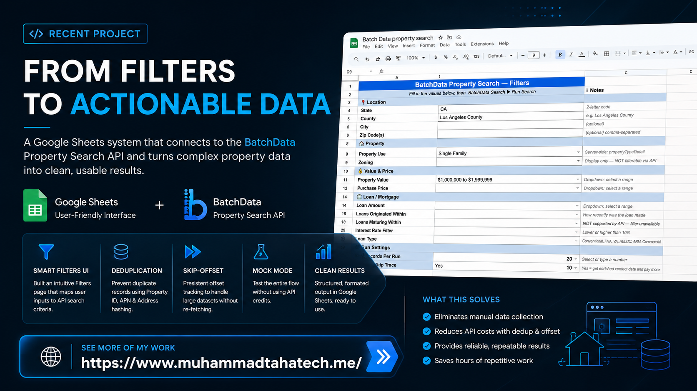

# Google Sheets Property Search Case Study

## Overview

This case study describes a Google Sheets automation workflow that turns a property data API into a structured data collection and lead-generation pipeline.

It is written for developers, analysts, and product stakeholders who want to understand how to build a low-code data ingestion system with strong deduplication, state management, and debug tooling.

## Problem Statement

Real estate analytics teams frequently need to collect and qualify property leads using large external datasets.

Existing solutions often require separate ETL pipelines, BI tools, or custom web apps. This case study demonstrates how to implement the same capability entirely inside Google Sheets, making it accessible to business users while preserving a technical audit trail.

## Solution Summary

The workflow is designed around three key requirements:

- easy filter-driven search configuration inside a spreadsheet
- single-request integration to limit API usage and maintain predictable billing
- robust deduplication and offset tracking for ongoing data collection

The solution delivers a compact, developer-friendly pattern for spreadsheet-backed automation.

## Visuals

### Filter UI

### Thumbnail

## Architecture

### Functional Layers

- **UI layer**: a custom Google Sheets menu and filter sheet
- **Payload layer**: transforms sheet values into structured API search criteria
- **API layer**: executes the HTTP request, handles responses, and normalizes the returned data
- **Storage layer**: writes normalized rows into a results view and logs run history
- **State layer**: maintains a persistent offset and dedup sets for continuous ingestion

### Data Flow

1. user enters filter values in the spreadsheet
2. the system builds a payload for the property search endpoint
3. a single API call is made for that run
4. returned records are cleaned, normalized, and deduplicated
5. new rows are appended to the results table and the run is logged

## Technical Highlights

### Filter Construction

The filter UI supports structured search inputs such as:

- location filters: state, county, city, zip codes
- property classification: use, type, zoning
- valuation and price ranges
- loan characteristics: amount, origination age, interest rate, loan type
- optional contact enrichment for email and phone data

The payload generator maps these values into API operators like `equals`, `inList`, `min`, `max`, and `minDate`.

### Deduplication Strategy

This workflow avoids duplicate rows through multi-key deduplication:

- property identifier values from the API
- APN / parcel numbers
- address hash keys

The system also sends existing property IDs back to the API as exclusions where supported. This prevents repeated billing for the same properties across runs.

### Persistent Offset Tracking

To support continuous data collection, the system stores a run offset in script-managed properties.

- the offset initializes from existing result rows on first use
- it increments by the number of fetched rows after each run
- it can be reset or recalibrated if needed

This enables the workflow to progressively consume new records without starting over.

### Data Normalization

Returned API records are flattened into a table schema optimized for analysis and CRM export.

Key normalized output fields include:

- owner first/last name, mailing address, emails, phones
- property address, APN, type/use/zoning
- valuation, equity, and loan terms
- foreclosure and mortgage release details
- transfer dates and previous owners

The normalization layer includes data sanitization for inconsistent records, such as:

- mixed-format owner names
- variable email / phone array structures
- missing numeric values and date-like payload artifacts

### Debug & Testing Support

The solution includes built-in developer tools:

- payload preview without invoking the API
- single-record field inspection for schema validation
- raw response dump for troubleshooting
- mock mode for safe testing without live API calls

These tools are valuable for onboarding new developers and confirming integration behavior before enabling production access.

## Lessons for Developers

This case study presents several reusable patterns:

- use spreadsheets as a lightweight front-end for API-driven workflows
- separate UI/filter state from persistent ingestion state
- prefer single-request runs when API billing is per call
- enforce deduplication both before and after data ingestion
- include debug routes that expose payloads and raw response structure

## Repository Contents

- this README as the full case study
- two image assets used for portfolio presentation:
  - `image/banner.png`
  - `image/filters page.png`

No internal script files or API credentials are included.

## Contact

**Muhammad Taha**

  

- Email: contact.taha2005@gmail.com
- Portfolio: https://www.muhammadtahatech.me/

---

*This case study is intentionally written as a standalone technical presentation. It omits source code and confidential API details while preserving meaningful engineering insights.*
